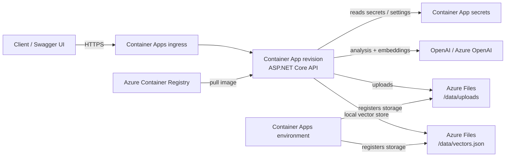
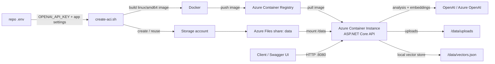
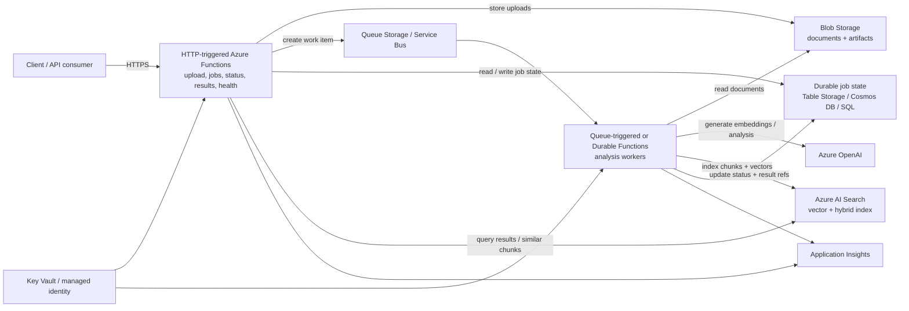

# Deploying to Azure

This guide covers deploying the Conflict & Duplication Detector web application as a container to Azure using **Azure Container Apps** or **Azure Container Instances**. The same ASP.NET Core host serves the GOV.UK-styled server-rendered frontend, the `/api/*` endpoints, and Swagger documentation at `/swagger`. It also outlines a future serverless option using **Azure Functions** and **Azure AI Search**.

## Prerequisites

- Azure subscription
- Azure CLI installed (`az --version`)
- Docker installed (for building/pushing images)
- OpenAI API key

## Application URLs

The container listens on port `8080`. The same ASP.NET Core host serves the GOV.UK-styled Razor Pages frontend, the HTTP API, and Swagger.

### Web frontend pages

| Path | Purpose |
|------|---------|
| `/` | Dashboard with knowledge-base status and recent jobs |
| `/Upload` | Upload documents to the knowledge base |
| `/Analyse` | Run duplication, conflict, or inconsistency analysis |
| `/Check` | Check a single document against the knowledge base |
| `/Chat` | Ask a natural-language question about ingested documents |
| `/Jobs` | List recent background jobs |
| `/Jobs/{jobId}` | Job status and results (auto-refreshes while pending or running) |

The frontend follows the [GOV.UK Design System](https://design-system.service.gov.uk/) with a shared layout, phase banner, service navigation, validation summary, forms, tables, panels, and structured result rendering.

### API and documentation

| Path | Purpose |
|------|---------|
| `/swagger` | Swagger UI for API documentation and manual API calls |
| `/api/*` | HTTP API endpoints for automation and integrations |
| `/api/health` | Health check endpoint |

When `Auth__ApiKey` is configured, `/api/*` routes require the `X-Api-Key` header except `/api/health`. Browser pages and static assets do not require an API key. The server-rendered frontend keeps API and OpenAI keys on the server and calls the application services in-process.

## Configuration via Environment Variables

The application can be configured entirely through environment variables, making it ideal for container deployments. These replace the `appsettings.json` configuration.

### Required Environment Variables

| Variable | Description | Example |
|----------|-------------|---------|
| `OPENAI_API_KEY` | Your OpenAI or Azure OpenAI API key | `sk-...` or Azure key |
| `Auth__ApiKey` | Inbound API key clients must send in the `X-Api-Key` header | any strong secret string |

### Optional Environment Variables

| Variable | Description | Default |
|----------|-------------|---------|
| `OpenAI__Provider` | AI provider: `OpenAI` or `AzureOpenAI` | `OpenAI` |
| `OpenAI__Model` | Model deployment name for analysis | `gpt-5.1` |
| `OpenAI__EmbeddingModel` | Model for embeddings | `text-embedding-3-small` |
| `OpenAI__AzureEndpoint` | Azure OpenAI endpoint URL | `null` |
| `OpenAI__AzureApiVersion` | Azure OpenAI API version | `2024-02-01` |
| `OpenAI__ApiKeyHeader` | Custom API key header name (e.g., `Api-Key`) | `null` |
| `VectorStore__PersistPath` | Path to persist vector store | `/data/vectors.json` |
| `VectorStore__MaxSearchResults` | Max results from vector search | `10` |
| `Storage__UploadsPath` | Path for uploaded files | `/data/uploads` |
| `Analysis__DuplicationThreshold` | Similarity threshold for duplicates | `0.85` |
| `Analysis__ChunkSize` | Document chunk size | `512` |
| `Analysis__ChunkOverlap` | Overlap between chunks | `50` |
| `Analysis__MaxConcurrentAgents` | Max parallel agent execution | `3` |
| `Jobs__RetentionHours` | How long to keep job results | `24` |

> **Note**: Use double underscores (`__`) to represent nested configuration in environment variables (e.g., `OpenAI__Model` maps to `OpenAI.Model` in appsettings.json).

---

## Quick start: ACI scripts (fastest path today)

For a one-shot container deployment today, use the scripts in this directory. They read secrets and OpenAI settings from the repo-root [`.env`](../../.env) file (copy from [`.env.example`](../../.env.example)).

```bash
# 1. Log in and configure secrets locally
az login
cp .env.example .env   # if needed — set OPENAI_API_KEY, Auth__ApiKey, Azure OpenAI vars

# 2. Deploy (creates RG, ACR, storage, and ACI)
./deployments/azure/create-aci.sh

# 3. Tear down when finished
./deployments/azure/destroy-aci.sh --yes
```

The create script prints the public URL when done. ACI serves **HTTP** on port **8080** (not HTTPS). The root URL opens the web frontend; API documentation remains available at `/swagger`.

| Script | Purpose |
|--------|---------|
| [`create-aci.sh`](create-aci.sh) | Build image, push to ACR, provision storage, run ACI |
| [`destroy-aci.sh`](destroy-aci.sh) | Delete the ACI container, ACR, and local deploy state; leave the resource group intact |

**Create script options:**

```bash
./deployments/azure/create-aci.sh --skip-storage   # skip Azure Files; data lost on restart
./deployments/azure/create-aci.sh --redeploy       # rebuild image and recreate container (after first deploy)
```

**Optional overrides** (export before running):

| Variable | Default |
|----------|---------|
| `AZURE_RESOURCE_GROUP` | `rg-conflict-detector` |
| `AZURE_LOCATION` | `uksouth` |
| `ACI_ACR` | Reuse existing ACR in the resource group, or create `crdocumentanalysis<suffix>` |
| `ACI_IMAGE_PLATFORM` | `linux/amd64` |
| `ACI_CPU` | `2` |
| `ACI_MEMORY_GB` | `4` |

The create script skips ACR creation when a registry with that name already exists (any resource group in your subscription). Set `ACI_ACR` to pin a specific registry name across runs.

ACI expects an `amd64` Linux image. On Apple Silicon Macs, Docker may otherwise build `linux/arm64`, which can pull successfully in ACI but crash immediately with connection resets on the health endpoint. The script defaults to `linux/amd64` to avoid that.

Deploy state is written to `deployments/azure/.aci-deploy.env` (gitignored) so `destroy-aci.sh` knows which container and registry to delete.

### Next step: Azure Container Apps

ACI is the quickest way to get running today. For a longer-lived deployment, **Azure Container Apps** is the logical next step — it adds HTTPS ingress, scaling, and managed revisions. Keep the app at a single replica until job state is moved out of the in-memory queue, otherwise a browser polling a job may hit an instance that did not create that job.

When moving to Container Apps, mount the Azure Files share at `/data` so uploads and the vector store persist (the create script below registers storage on the environment but does not attach it to the app — add the volume mount explicitly):

```bash
# After create-aci.sh-style storage is registered on the Container Apps environment (Option 1, Step 3)
az containerapp create \
  ... \
  --volume-mounts "data=/data"
```

Or on an existing app:

```bash
az containerapp update \
  --name ca-conflict-detector \
  --resource-group rg-conflict-detector \
  --volume-mounts "data=/data"
```

---

## Option 1: Azure Container Apps (Recommended container approach)

Azure Container Apps provides a fully managed serverless container platform with built-in scaling, HTTPS ingress, and persistent storage.

### Container Apps architecture diagram



### Step 1: Build and Push Container Image

```bash
# Login to Azure
az login

# Create a resource group (if needed)
az group create --name rg-conflict-detector --location uksouth

# Create Azure Container Registry
az acr create --resource-group rg-conflict-detector \
  --name crconflictdetector --sku Basic

# Login to ACR
az acr login --name crconflictdetector

# Build and push image
docker build -t crconflictdetector.azurecr.io/conflict-detector:latest .
docker push crconflictdetector.azurecr.io/conflict-detector:latest
```

### Step 2: Create Container Apps Environment

```bash
# Create Container Apps environment
az containerapp env create \
  --name cae-conflict-detector \
  --resource-group rg-conflict-detector \
  --location uksouth
```

### Step 3: Create Azure Files Storage (for persistence)

```bash
# Create storage account
az storage account create \
  --name stconflictdetector \
  --resource-group rg-conflict-detector \
  --location uksouth \
  --sku Standard_LRS

# Get storage account key
STORAGE_KEY=$(az storage account keys list \
  --resource-group rg-conflict-detector \
  --account-name stconflictdetector \
  --query '[0].value' -o tsv)

# Create file share
az storage share create \
  --name data \
  --account-name stconflictdetector \
  --account-key $STORAGE_KEY

# Add storage to Container Apps environment
az containerapp env storage set \
  --name cae-conflict-detector \
  --resource-group rg-conflict-detector \
  --storage-name data \
  --azure-file-account-name stconflictdetector \
  --azure-file-account-key $STORAGE_KEY \
  --azure-file-share-name data \
  --access-mode ReadWrite
```

### Step 4: Deploy Container App

```bash
# Enable ACR admin credentials
az acr update --name crconflictdetector --admin-enabled true

# Get ACR credentials
ACR_PASSWORD=$(az acr credential show \
  --name crconflictdetector \
  --query 'passwords[0].value' -o tsv)

# Create Container App
az containerapp create \
  --name ca-conflict-detector \
  --resource-group rg-conflict-detector \
  --environment cae-conflict-detector \
  --image crconflictdetector.azurecr.io/conflict-detector:latest \
  --registry-server crconflictdetector.azurecr.io \
  --registry-username crconflictdetector \
  --registry-password $ACR_PASSWORD \
  --target-port 8080 \
  --ingress external \
  --min-replicas 1 \
  --max-replicas 3 \
  --cpu 1.0 \
  --memory 2Gi \
  --env-vars \
    "OPENAI_API_KEY=secretref:openai-key" \
    "Auth__ApiKey=secretref:api-key" \
    "VectorStore__PersistPath=/data/vectors.json" \
    "Storage__UploadsPath=/data/uploads" \
  --secrets "openai-key=YOUR_OPENAI_API_KEY_HERE" "api-key=YOUR_INBOUND_API_KEY_HERE"
```

### Step 5: Configure Environment Variables via Azure Portal

1. Navigate to [Azure Portal](https://portal.azure.com)
2. Go to **Container Apps** → **ca-conflict-detector**
3. Click **Containers** in the left menu
4. Click **Edit and deploy** → **Container image**
5. Scroll to **Environment variables**
6. Add or update variables:

   | Name | Source | Value |
   |------|--------|-------|
   | `OPENAI_API_KEY` | Reference a secret | `openai-key` |
   | `Auth__ApiKey` | Reference a secret | `api-key` |
   | `OpenAI__Model` | Manual entry | `gpt-5.1` |
   | `OpenAI__EmbeddingModel` | Manual entry | `text-embedding-3-small` |
   | `VectorStore__PersistPath` | Manual entry | `/data/vectors.json` |
   | `Storage__UploadsPath` | Manual entry | `/data/uploads` |
   | `Analysis__DuplicationThreshold` | Manual entry | `0.85` |

7. Click **Create** to deploy the new revision

### Managing Secrets in Azure Portal

1. Go to **Container Apps** → **ca-conflict-detector**
2. Click **Secrets** in the left menu
3. Click **+ Add** and create both secrets:

   | Key | Value |
   |-----|-------|
   | `openai-key` | Your OpenAI / Azure OpenAI API key |
   | `api-key` | The inbound API key clients will send in `X-Api-Key` |

4. Click **Add**

Then reference secrets in environment variables using `secretref:<key>`, e.g. `secretref:api-key`.

---

## Option 2: Azure Container Instances (Simpler, No Scaling)

Use the [Quick start scripts](#quick-start-aci-scripts-fastest-path-today) above for a guided deploy. The manual steps below are equivalent.

ACI is ideal for a POC or demo today: one container, public DNS, Azure Files mounted at `/data`. It does not auto-scale and serves HTTP only. To update env vars or the image, recreate the container (`create-aci.sh --redeploy`) or delete and redeploy.

### ACI architecture diagram



### Automated deploy

```bash
./deployments/azure/create-aci.sh
./deployments/azure/destroy-aci.sh --yes
```

`destroy-aci.sh` deletes the ACI container and Azure Container Registry named in deploy state, but it does not delete the resource group.

### Manual deploy

Build and push the image first (see [Option 1, Step 1](#step-1-build-and-push-container-image)), create Azure Files storage (see [Option 1, Step 3](#step-3-create-azure-files-storage-for-persistence) — skip the Container Apps environment storage command), then:

```bash
az container create \
  --resource-group rg-conflict-detector \
  --name aci-conflict-detector \
  --image crconflictdetector.azurecr.io/conflict-detector:latest \
  --registry-login-server crconflictdetector.azurecr.io \
  --registry-username crconflictdetector \
  --registry-password $ACR_PASSWORD \
  --dns-name-label conflict-detector \
  --ports 8080 \
  --cpu 2 \
  --memory 4 \
  --environment-variables \
    OpenAI__Provider=AzureOpenAI \
    OpenAI__AzureEndpoint=https://your-endpoint \
    OpenAI__AzureApiVersion=2024-10-21 \
    OpenAI__ApiKeyHeader=api-key \
    OpenAI__Model=gpt-5.1 \
    OpenAI__EmbeddingModel=text-embedding-3-small \
    VectorStore__PersistPath=/data/vectors.json \
    Storage__UploadsPath=/data/uploads \
  --secure-environment-variables \
    OPENAI_API_KEY=YOUR_OPENAI_API_KEY_HERE \
    Auth__ApiKey=YOUR_INBOUND_API_KEY_HERE \
  --azure-file-volume-account-name stconflictdetector \
  --azure-file-volume-account-key $STORAGE_KEY \
  --azure-file-volume-share-name data \
  --azure-file-volume-mount-path /data
```

### Verify ACI deployment

```bash
FQDN=$(az container show \
  --resource-group rg-conflict-detector \
  --name aci-conflict-detector \
  --query ipAddress.fqdn -o tsv)

curl "http://${FQDN}:8080/api/health"
# Swagger: http://${FQDN}:8080/swagger
```

### Configure via Azure Portal

1. Navigate to [Azure Portal](https://portal.azure.com)
2. Go to **Container Instances** → **aci-conflict-detector**
3. Click **Containers** in the left menu
4. Click **Settings** → **Environment variables**
5. View existing variables or recreate with updated values

> **Note**: ACI requires recreating the container to update environment variables. Use `create-aci.sh --redeploy` or the CLI.

---

## Option 3: Azure Functions + Azure AI Search (Future Iteration)

For a future production iteration, split the current API into Azure Functions and move vector storage/search from the local JSON file under `/data` into Azure AI Search. This would make the app more serverless: HTTP-triggered functions handle uploads, job creation, health checks, and result retrieval, while queue-triggered or durable functions run the longer document analysis workflow.

### Target architecture



- **HTTP-triggered Azure Functions** expose the current API surface, for example upload, create analysis job, get job status, get job result, and health.
- **Queue Storage or Service Bus** decouples request handling from long-running analysis work.
- **Durable Functions** can orchestrate multi-step analysis where progress, retries, fan-out/fan-in, or cancellation matter.
- **Blob Storage** stores uploaded documents and generated artifacts instead of using the container filesystem.
- **Azure AI Search** stores document chunks, embeddings, and metadata, replacing `VectorStore__PersistPath=/data/vectors.json`.
- **Azure OpenAI** generates embeddings and analysis responses, ideally accessed with managed identity where supported.
- **Application Insights** captures function logs, traces, dependency calls, and job diagnostics.

### Pros

- **Scales to zero for idle usage**: HTTP and background processing only run when requests or queued work arrive.
- **Better scaling model for ingestion**: queue-triggered workers can scale independently from the public API endpoints.
- **Managed vector search**: Azure AI Search provides indexing, filtering, hybrid search, vector search, and operational tooling instead of maintaining a local vector JSON file.
- **More resilient long-running jobs**: Durable Functions or queue-based workers provide retries, checkpoints, and clearer job orchestration than a single always-on container.
- **Less filesystem coupling**: uploads and vector data move to Azure-managed services, avoiding Azure Files mounts and container restart edge cases.

### Cons

- **Larger refactor**: the current ASP.NET Core API is packaged as one container; Azure Functions need smaller endpoint handlers and background workflows.
- **More Azure services to operate**: Functions, Storage, queues, AI Search, OpenAI, Key Vault, and Application Insights all need provisioning, configuration, and monitoring.
- **Cold start and timeout considerations**: HTTP functions should stay thin, and longer analysis must run in background functions or Durable Functions.
- **Different local development model**: developers need the Azure Functions Core Tools and local emulators or dev Azure resources for queues, blobs, and search.
- **Search schema and indexing need design**: Azure AI Search requires explicit index fields, vector dimensions, metadata filters, and migration/rebuild plans.

### Changes needed

- Split the API endpoints in `src/ConflictDuplicationDetector.Api` into Azure Function triggers, preserving the current request/response models where possible.
- Move job state out of in-memory or local process state into durable storage, such as Table Storage, Cosmos DB, SQL, or Durable Functions instance state.
- Replace the local vector store implementation with an Azure AI Search-backed implementation for chunk indexing, vector similarity search, and metadata filtering.
- Store uploaded files in Blob Storage and pass blob references through job messages instead of writing to `Storage__UploadsPath`.
- Add queue or Service Bus messages for background analysis so HTTP requests can return a job ID quickly.
- Introduce Azure Functions configuration, such as `host.json`, `local.settings.json` templates, app settings, managed identity, and Key Vault references.
- Add infrastructure scripts or Bicep/Terraform for Function App, Storage, Azure AI Search, Azure OpenAI, Application Insights, and role assignments.
- Update Swagger/OpenAPI generation because Azure Functions do not automatically use the current ASP.NET Core middleware and endpoint mapping in the same way.
- Add integration tests for the Azure AI Search vector store and queue-driven job lifecycle.

---

## Using Azure OpenAI Instead of OpenAI

If you're using Azure OpenAI Service instead of the public OpenAI API:

```bash
# Set these environment variables
OpenAI__Provider=AzureOpenAI
OpenAI__AzureEndpoint=https://your-resource.openai.azure.com/
OpenAI__AzureApiVersion=2024-02-01
OpenAI__Model=your-deployment-name
OpenAI__EmbeddingModel=your-embedding-deployment-name
OPENAI_API_KEY=your-azure-openai-key

# If using a custom API key header (e.g., DfE sandbox)
OpenAI__ApiKeyHeader=Api-Key
```

In Azure Portal, add these as environment variables:

| Name | Value |
|------|-------|
| `OpenAI__Provider` | `AzureOpenAI` |
| `OpenAI__AzureEndpoint` | `https://your-resource.openai.azure.com/` |
| `OpenAI__AzureApiVersion` | `2024-02-01` |
| `OpenAI__Model` | Your deployed model name |
| `OpenAI__EmbeddingModel` | Your embedding model deployment name |
| `OpenAI__ApiKeyHeader` | Custom header name (e.g., `Api-Key`) - optional |
| `OPENAI_API_KEY` | (use secret reference) |

### Example: DfE Education Sandbox

For the Department for Education OpenAI sandbox:

```bash
OpenAI__Provider=AzureOpenAI
OpenAI__AzureEndpoint=your-url
OpenAI__ApiKeyHeader=Api-Key
OpenAI__Model=gpt-5.1
OpenAI__EmbeddingModel=text-embedding-3-small
OPENAI_API_KEY=your-dfe-api-key
```

---

## Verify Deployment

### Container Apps

```bash
FQDN=$(az containerapp show \
  --name ca-conflict-detector \
  --resource-group rg-conflict-detector \
  --query properties.configuration.ingress.fqdn -o tsv)

curl "https://${FQDN}/api/health"
# Swagger: https://${FQDN}/swagger
```

### Container Instances

```bash
FQDN=$(az container show \
  --resource-group rg-conflict-detector \
  --name aci-conflict-detector \
  --query ipAddress.fqdn -o tsv)

curl "http://${FQDN}:8080/api/health"
# Swagger: http://${FQDN}:8080/swagger
```

---

## Troubleshooting

### View Container Logs

```bash
# Container Apps
az containerapp logs show \
  --name ca-conflict-detector \
  --resource-group rg-conflict-detector \
  --follow

# Container Instances
az container logs \
  --resource-group rg-conflict-detector \
  --name aci-conflict-detector
```

### Common Issues

| Issue | Solution |
|-------|----------|
| `503 Service Unavailable` | Check `OPENAI_API_KEY` is set correctly |
| Container fails to start | Check logs for missing environment variables |
| Data not persisting | Verify Azure Files mount at `/data` |
| Slow response times | Increase CPU/memory allocation |
